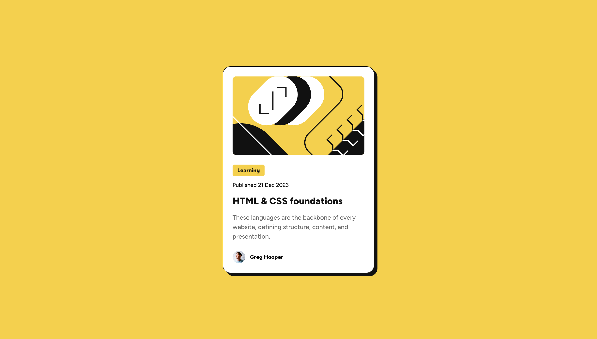

# Frontend Mentor - Blog preview card solution

This is a solution to the [Blog preview card challenge on Frontend Mentor](https://www.frontendmentor.io/challenges/blog-preview-card-ckPaj01IcS). Frontend Mentor challenges help you improve your coding skills by building realistic projects.

## Table of contents

- [Overview](#overview)
  - [Screenshot](#screenshot)
  - [Links](#links)
- [My process](#my-process)
  - [Built with](#built-with)
  - [What I learned](#what-i-learned)
  - [Continued development](#continued-development)
  - [Useful resources](#useful-resources)
- [Author](#author)

## Overview

### Screenshot



### Links

- [GitHub repository](https://github.com/alexwilkom/blog-preview-card)
- [Live Site](https://alexwilkom.github.io/blog-preview-card/)

## My process

### Built with

- CSS custom properties
- Flexbox
- Media Queries
- Self hosting and variable fonts

### What I learned

- I touched on the topic on what are and how to use variable fonts.
- I practiced using `@font-face` and self hosting for the fonts.

```css
@font-face {
  font-family: "Figtree";
  /* I did not choose to convert ttf to woff2 as the file is already low in size (63KB) */
  src: url("../assets/fonts/Figtree-VariableFont_wght.ttf") format("truetype-variations");
  /* This is a range of weights to use on the font */
  font-weight: 500 800;
  /* Explanation for 'font-display': https://web.dev/articles/font-best-practices#choose_an_appropriate_font-display_strategy */
  font-display: fallback;
}
```

### Continued development

The use and research of variable fonts gave me more awareness of the vastness topic of typography in general. Reading resources about it left me wondering about more basic practices around how to use text and fonts effectively on the web. I will definitely keep exploring in depth and practicing typography.

### Useful resources

- [Best practices for fonts](https://web.dev/articles/font-best-practices) - This helped me with understanding how to use @font-face.
- [Variable fonts guide](https://developer.mozilla.org/en-US/docs/Web/CSS/CSS_fonts/Variable_fonts_guide) - This article on MDN helped me gaining a good view of what variable fonts are and the variations to implement with @font-face. For a video on the topic, see next resource.
- [Getting started with Variable fonts on the web](https://www.youtube.com/watch?v=0fVymQ7SZw0) - This video by Kevin Powell gave me a better understanding on how to use variable fonts in my project.

## Author

- GitHub - [Alex Wilkom](https://github.com/alexwilkom)
- Frontend Mentor - [@alexwilkom](https://www.frontendmentor.io/profile/alexwilkom)
